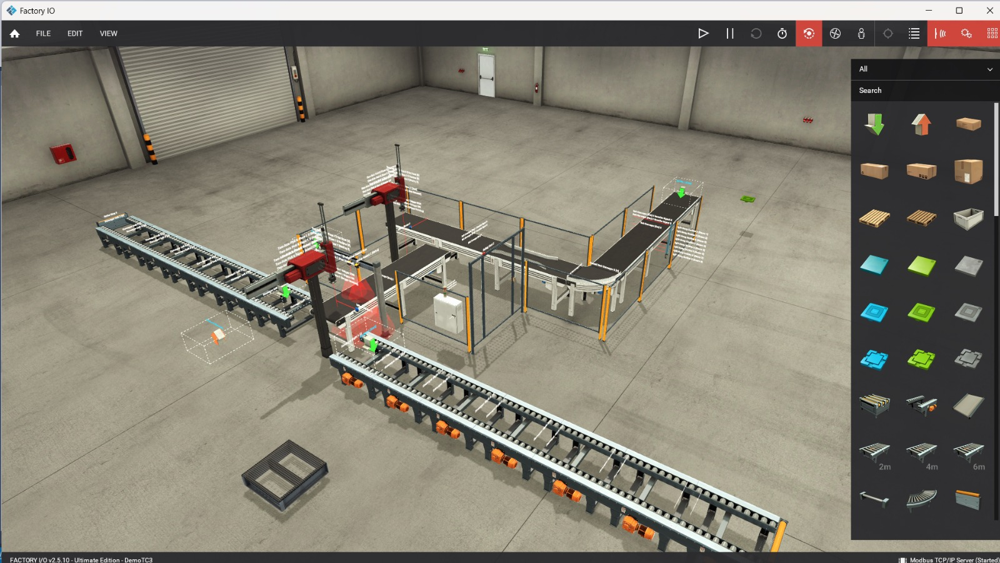
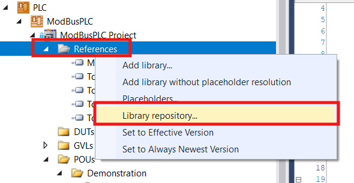
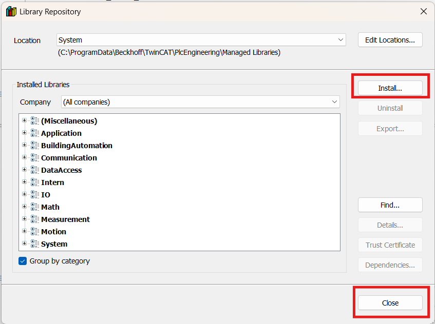

# FactoryIO_TwinCAT 📦

A demonstration repository showing how to connect **Factory I/O** to a **TwinCAT PLC project** via Modbus TCP. The included demo implements a simple pick‑and‑place production cell driven by a PLC state machine.


---

## 🚀 Getting Started

### 🧩 Prerequisites

- **Beckhoff TwinCAT 3**
- **Factory I/O** (scene included under `/Factory_IO_Scene`)
- Modbus TCP communication support (TF6250 library)

### ⚙️ Setup Instructions

1. Open the demo Factory I/O scene located in `/Factory_IO_Scene`.
2. Load the TwinCAT solution from this repository.
3. Add the required Modbus library:
   - Right‑click **References** in the PLC project.
   
   - Choose **Library Repository → Install** and select the file from the `Dependencies` folder.
   g
   - Close the dialog when finished.
4. Open the TwinCAT package manager and install **TF6250** (Modbus TCP).
5. Activate the TwinCAT solution and start the simulation in Factory I/O.

> ✅ The system should now be communicating via Modbus between Factory I/O and the PLC.

---

## 🧠 Demo Overview

This repository also contains a **Pick & Place** demo which illustrates:

- Conveyor control
- Product detection
- Pick‑and‑place motion (X/Z axes)
- Gripper control
- Rotational handling (CW/CCW)
- Timed actions and synchronization

All logic is implemented in a single PLC program (POU) for clarity and educational purposes.

### 🏭 System Layout

```
Conveyor → Product Sensor → Pick & Place Robot → Conveyor Out
```

### 🔁 Process Sequence

1. All conveyors run.
2. A product reaches the sensor.
3. Conveyors stop.
4. Robot moves to pick position and grips the product.
5. Robot rotates clockwise, moves to place position, and releases.
6. Robot rotates counter‑clockwise to home.
7. Conveyors restart for the next product.

### 📋 State Machine Workflow

| State | Description                                 |
|-------|---------------------------------------------|
| 0     | Conveyors running, waiting for product      |
| 10    | Move robot above pick position              |
| 20    | Move robot down to pick position            |
| 30    | Grab product                                |
| 40    | Lift product                                |
| 50    | Rotate CW                                   |
| 60    | Move to place position                      |
| 70    | Move down to place                          |
| 80    | Release product                             |
| 90    | Lift robot                                  |
| 100   | Rotate CCW                                  |
| 110   | Restart conveyors                           |

---

## 📡 I/O Mapping

### Digital I/O

| PLC Variable          | Factory I/O        | Description                                |
|-----------------------|--------------------|--------------------------------------------|
| `GVL_IO.Output[0]`    | Conveyor 1         | Conveyor motor                             |
| `GVL_IO.Output[1]`    | Conveyor 2         | Conveyor motor                             |
| `GVL_IO.Output[2]`    | Conveyor 3         | Conveyor motor                             |
| `GVL_IO.Input[0]`     | Product Sensor     | Detect incoming product                    |
| `GVL_IO.Output[4]`    | Rotate CW          | Robot head rotation clockwise              |
| `GVL_IO.Output[5]`    | Rotate CCW         | Robot head rotation counter-clockwise      |
| `GVL_IO.Output[6]`    | Grab               | Gripper output                             |

### Analog Control

| Variable | Description                  |
|----------|------------------------------|
| `X_Cmd`  | X axis command position      |
| `Z_Cmd`  | Z axis command position      |
| `X_Act`  | X axis feedback              |
| `Z_Act`  | Z axis feedback              |

---

## ⚙️ Motion Control Concept

A simple position controller is used:

```
Command Position → Factory I/O → Motion → Feedback → PLC
```

The PLC monitors movement completion with a tolerance check:

```
ABS(Target - Actual) < Tolerance
```

This ensures the state machine only advances once the robot really reaches each target.

---

## ✨ Key Features

- Simple, single‑file PLC state machine architecture
- Fully deterministic sequence control
- Timer‑based synchronization
- Safety interlock: CW and CCW rotation cannot be active simultaneously
- Educational focus with minimal code complexity

---

Feel free to explore the TwinCAT project and experiment with the Factory I/O scene!
